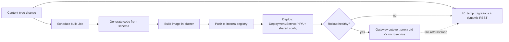
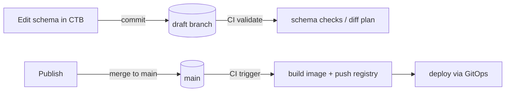

# 10 — Deployment Modes, Progressive Promotion & GitOps Codegen (Design)

Status: **Proposed** · Date: 2026-07-30 · Related: [09-codegen-and-sandbox.md](09-codegen-and-sandbox.md), [01-architecture.md](01-architecture.md), [07-offline-sync.md](07-offline-sync.md)

This document extends the 3-layer model in [09](09-codegen-and-sandbox.md). It defines how `ferriscms` **progressively upgrades** the execution of a content-type — from the always-available in-process dynamic engine, to a containerized generated service, to a fully deployed microservice under a Kubernetes operator — and how content (and code) can be **fully decoupled** from this service via GitOps codegen into independent monolith/microservice/monorepo/multirepo projects.

The guiding principle: **the Content Manager is always the gateway.** It never blocks on code generation; it serves requests immediately via the dynamic engine and *transparently promotes* to a faster/owned backend when one becomes ready, and *demotes* back to the dynamic engine if a backend fails.

---

## 1. The progressive execution ladder

A single content-type (or a group of schemas) can be served at one of several **maturity levels**. The gateway resolves each request to the **highest ready** level and falls back down the ladder on failure.

| Level | Backend | Where it runs | Trigger | Fallback to |
|---|---|---|---|---|
| **L0 — Dynamic engine** | in-process `dynamic-store` + hot router ([01](01-architecture.md), [03](03-content-type-builder-logic.md)) | this process | always available | — (floor) |
| **L1 — Containerized service** | generated service in a local **Docker** container | Docker on the same host | Docker detected + build succeeded | L0 |
| **L2 — Deployed microservice** | generated service on **Kubernetes** | cluster | operator reconcile + rollout healthy | L0 (or L1) |
| **L3 — External / GitOps project** | generated code owned by the user | anywhere (their infra/provider) | schema exported + CI/CD built & deployed | not managed by us |

L0 is the **floor and the fallback** in every mode. L1–L3 are optional accelerations/decouplings. This guarantees the app is always functional offline and online, exactly as [09](09-codegen-and-sandbox.md) requires.

---

## 2. Capability detection (runtime, at startup and on change)

The app probes its environment and records a `RuntimeCapabilities` value:

- `docker`: is a Docker daemon reachable? (probe the socket / `docker version`).
- `kubernetes`: are we running in / do we have credentials to a cluster? (in-cluster service account or a kubeconfig).
- `registry`: is an image registry configured/reachable (internal or external)?
- `git_remote`: is a Git provider configured (GitHub/GitLab/Gitea) with a token?
- `toolchain`: is a Rust toolchain locally available (offline builds)?

Capabilities select the **promotion policy**:

| Environment | Detected | Behavior |
|---|---|---|
| **Desktop, no Docker** | `docker=false` | **L0 only.** Content Manager + table creation run automatically from content-types (dynamic). No codegen at runtime. Eject/export still available on demand ([09 §6](09-codegen-and-sandbox.md)). |
| **Desktop, Docker present** | `docker=true` | Delegate codegen → **build → run in Docker (L1)**; gateway **proxies to the container** when healthy; **falls back to L0** if the container is down/absent. |
| **Kubernetes** | `kubernetes=true` | App also acts as **API gateway + operator**. Serve via L0 immediately; in parallel **schedule a build job → push to registry → deploy microservice (L2)**; gateway redirects to the microservice when ready. Same promotion applies to the **UI**. |

Capability detection re-runs when config changes (e.g., Docker becomes available) so the policy can upgrade without a restart.

---

## 3. Desktop mode

### 3.1 No Docker (L0)
- Content-type Save → `services::content_type_builder::apply` runs DDL via `dynamic-store` and hot-rebuilds the router ([01 §5](01-architecture.md)).
- All CRUD served in-process. This is the pure offline experience.

### 3.2 Docker available (L0 → L1)
1. On Save, L0 serves immediately (no waiting).
2. In the background: **generate** a service project from the schema(s) ([09 §6](09-codegen-and-sandbox.md)), **build** an image in Docker, **run** the container.
3. The container is started with shared config injected (§6): DB connection, tracing endpoint, secrets.
4. Gateway **health-checks** the container; once healthy, it **proxies matching routes to the container** (L1) and stops using L0 for those routes.
5. If the container stops/fails health, the gateway **demotes to L0** transparently. No request is dropped.

```
CTB Save ─► L0 serves now ─► (bg) generate ─► docker build ─► docker run ─► healthy?
                                                                              │ yes
                     gateway route table: uid → container  ◄─────────────────┘
                                                                              │ no / crash
                     gateway route table: uid → L0 (fallback) ◄──────────────┘
```

---

## 4. Kubernetes mode — gateway + operator

Here the app plays **three roles at once**: (a) the CMS/gateway, (b) a Kubernetes **operator/controller** that reconciles content-types into running microservices, and (c) the L0 fallback engine.

### 4.1 Immediate path (temporary dynamic serving)
On a content-type change the operator **temporarily** applies migrations and serves requests via **dynamic REST derived from the schema** (L0), so there is never downtime while code is being generated.

### 4.2 Parallel promotion job (schema → microservice)
In parallel, the operator schedules a **build Job**:

1. **Generate** a microservice (or a group service for multiple schemas) from the schema(s).
2. **Build** the image inside the cluster (Job/Kaniko/BuildKit — rootless, no privileged Docker).
3. **Push** to the **internal registry**.
4. **Deploy**: create/patch `Deployment` + `Service` (+ `HPA`, `ConfigMap`, `Secret`), **sharing settings/configs** — database, tracing, secrets — from the operator (§6).
5. **Readiness**: wait for rollout + health.
6. **Cutover**: gateway **redirects the proxy to the microservice** (L2). L0 remains the fallback.



### 4.3 Operator reconciliation model
- **Desired state**: the schema registry (`content_type_schemas`) + a per-service deployment spec.
- **Actual state**: what is running in the cluster.
- The operator continuously **reconciles**: schema added/changed → (re)build + rollout; schema removed → scale down/delete; drift → repair.
- Represent each managed service as a custom resource, e.g. `ContentService` (CRD) `{ schemas: [uid...], topology, data_strategy, config_refs }`, so the whole thing is declarative and `kubectl`-inspectable. `[DECISION: CRD vs internal-only spec]`

### 4.4 UI promotion (same pattern)
The **admin/consumer UI** follows the identical ladder: served from the app initially, then a generated UI (following best practices — §7) is built, pushed, deployed, and the gateway routes `/admin` (or a generated app's routes) to it when ready, with fallback to the built-in Dioxus/WASM UI.

---

## 5. The gateway resolution & cutover contract

The gateway (Content Manager front) maintains a **route table**: `uid → BackendRef` where `BackendRef ∈ { Dynamic(L0), Container(L1, url), Service(L2, url), External(L3, url) }`.

Rules:
1. Resolve each request to the **highest ready** backend for its `uid`.
2. **Health-gated promotion**: only promote after readiness checks pass.
3. **Blue/green cutover**: keep the old backend warm until the new one serves N successful requests; then switch; then drain the old.
4. **Automatic demotion**: on health failure/timeout/5xx budget breach, drop to the next lower ready backend (ultimately L0).
5. **Idempotent + observable**: every promotion/demotion emits an event + trace span; surfaced in the UI ("Serving: dynamic / container / microservice").
6. **Consistency guard**: a promoted backend must pass a **schema-parity check** (its reported schema hash == registry hash) before receiving traffic, preventing drift between generated code and the live schema.

---

## 6. Shared configuration propagation

Generated containers/microservices inherit operational config from the app so they behave consistently:

- **Database**: either the **same** datastore (shared) or a **dedicated/provider** one (see §8) — injected as a connection secret.
- **Tracing/metrics/logs**: OpenTelemetry endpoint + service name/labels, so generated services appear in the same observability backend.
- **Secrets**: API keys, JWT secret (if it must validate the same tokens), provider credentials — via `Secret`/env, never baked into images.
- **Feature/config flags**: draft&publish, i18n locales, RBAC policy references.

Propagation is centralized in a `ServiceConfigBundle` the operator/gateway renders into env/ConfigMap/Secret for each backend. Generated code reads config from env (12-factor), never hard-codes.

---

## 7. Codegen independence & topologies (the important part)

Generated code **must be able to stand entirely on its own** — no runtime dependency on `ferriscms`. It is a genuine project the user owns. `ferriscms` becomes an optional **no/low-code design surface**, not a mandatory runtime, and **data need not be tied to this service.**

### 7.1 Supported output topologies
| Topology | Output | Use case |
|---|---|---|
| **Monolith** | one Axum + SeaORM app serving all schemas | simplest deployable |
| **Microservices** | one service per schema (or per bounded group) | scale/own per domain |
| **Monorepo** | all services + shared crates in one repo (workspace) | unified CI, shared libs |
| **Multirepo** | one repo per service/app | independent ownership/release |
| **UI app(s)** | generated frontend (see §7.3) | headless-with-UI or standalone app |

Topology is a generation parameter (`topology`, `grouping`), stored on the `ContentService`/eject spec.

### 7.2 Data ownership strategies (decoupled data)
Because "it's not necessary to tie data to this service," each generated project chooses a **data strategy**:
- **Shared DB** — same Postgres as `ferriscms` (fastest path; coupled).
- **Dedicated DB** — its own database/instance; schema migrations generated alongside code (owned, decoupled).
- **External provider** — target a managed provider (e.g. Postgres/MySQL/SQLite, or a BaaS) via a provider adapter (`[LATER]` adapters: Postgres, MySQL, SQLite, Supabase-style, PlanetScale-style, ...).
- **Headless / schema-only** — export just the schema/OpenAPI; the user wires their own storage.

The generator emits the correct entities, migrations, and connection config for the chosen strategy. Sync back into `ferriscms` (if desired) rides the sync engine ([07](07-offline-sync.md)) or is simply absent for fully decoupled deployments.

### 7.3 Best-practices requirement (UI **and** service)
All generated artifacts must follow idiomatic best practices, including:
- **Service**: layered structure (routes/handlers/services/domain/db), typed errors, config via env, migrations, health/readiness endpoints, OpenTelemetry, tests, Dockerfile, CI workflow, README. Dense SeaORM 2.0 entities + typed columns.
- **UI**: component structure, design tokens, accessibility, typed API client generated from the schema/OpenAPI, environment-based config, tests, build/CI. (Framework is a generation choice; default aligns with the project's Dioxus/WASM stack, with `[LATER]` templates for other stacks.)
- A **conformance checklist** the eject templates are validated against (lint/format/test must pass in CI before an artifact is considered "built").

---

## 8. GitOps codegen flow

Generation can be driven **entirely through Git + CI** on GitHub, GitLab, or Gitea — no in-app build required.

### 8.1 Schema-as-source-of-truth in Git
- Each content-type/component schema is a file in a repo (mirrors Strapi's `src/api/**/schema.json`).
- `ferriscms` reads/writes these via a **Git provider adapter** (GitHub/GitLab/Gitea REST APIs or a local clone + push).

### 8.2 Draft/publish → branch/merge mapping
Ties the CMS Draft & Publish workflow ([02](02-data-model.md)) to Git:

| CMS action | Git action | CI effect |
|---|---|---|
| Edit schema (draft) | commit to a **draft branch** (`schema/<uid>/draft`) | CI **validates** (lint schema, plan diff) — no deploy |
| Publish schema | **merge** draft branch → `main` | CI **builds** microservice/UI + **deploys** (GitOps) |
| Discard draft | delete/close the draft branch/PR | none |



### 8.3 CI/CD responsibilities
The generated CI workflow (per provider) runs: schema validation → codegen (Baker/MiniJinja) → build → test → push image → deploy (K8s manifests / Helm / Argo/Flux GitOps). The app can **open PRs**, **set commit statuses**, and **read workflow results** to update the gateway's L3 readiness.

### 8.4 Relationship to §4 (in-cluster) vs §8 (GitOps)
Two ways to reach L2/L3:
- **In-app operator** (§4): the app builds + deploys directly (self-contained).
- **GitOps** (§8): the app commits schema/code and lets external CI build + deploy (decoupled, auditable, provider-native).
Both may coexist; policy (`promotion.driver = operator | gitops | both`) decides. GitOps is the recommended path when the user wants code/data fully independent of `ferriscms`.

---

## 9. Failure handling & safety

- **Never block writes on build**: L0 always accepts writes; promotion is async.
- **Atomic cutover** with health gates + automatic demotion (§5).
- **Schema-parity guard** prevents a stale generated backend from serving mismatched data (§5.6).
- **Build sandboxing**: in-cluster builds are rootless (Kaniko/BuildKit); desktop builds use the local Docker daemon with resource limits ([09 §3](09-codegen-and-sandbox.md)).
- **Rollback**: keep the previous image/deployment; demote + redeploy previous on failure.
- **Secrets hygiene**: config via Secret/env only; never baked into images or committed to Git.
- **Data safety**: dedicated/provider data strategies must run migrations transactionally; schema removals unmap rather than hard-drop by default ([03 §8](03-content-type-builder-logic.md)).

---

## 10. State machine (per schema/service backend)

```
Dynamic(L0)
   │  promote requested (docker/k8s/gitops)
   ▼
Generating ──► Building ──► Pushing ──► Deploying ──► HealthChecking
   │              │            │            │              │ pass
   │ fail         │ fail       │ fail       │ fail         ▼
   └──────────────┴────────────┴────────────┴────────►  Live(proxied)
                          (any failure → stay/​return to Dynamic L0)     │ health loss
                                                                         ▼
                                                                    Demoting → Dynamic(L0)
```

Persist backend state in a system table:

**`service_backend`**
`id, schema_uids (json), mode (docker|k8s|gitops), topology, data_strategy, image_ref, endpoint_url, state, schema_hash, health, config_bundle_ref, created_at, updated_at` + sync columns ([07 §3](07-offline-sync.md)).

---

## 11. Consequences

**Positive**
- Zero-downtime, zero-wait UX: L0 always serves; faster/owned backends slot in transparently.
- Same mental model across desktop (Docker), cluster (operator), and external (GitOps).
- True decoupling: generated apps can outlive/leave `ferriscms`; data need not be tied to it.
- GitOps gives audit, review (draft→branch, publish→merge), and provider-native CI/CD.

**Negative / risks**
- Significant surface area (operator, gateway proxy, build pipelines, provider adapters) — strictly phase it (§13).
- Multiple execution levels can drift — mitigated by the schema-parity guard and generating from the single `Schema` model.
- In-cluster builds and multi-provider adapters are non-trivial; treat as later phases.
- Proxy/cutover adds latency + failure modes — mitigate with health gates, warm standby, and always-on L0 fallback.

---

## 12. Open decisions

1. **Promotion driver default** per mode: operator (self-contained) vs GitOps (decoupled) vs both.
2. **CRD vs internal spec** for the K8s operator (`ContentService`).
3. **Grouping policy** for microservices: one-per-schema vs bounded-context grouping — who decides, and how.
4. **Default data strategy** when promoting (shared vs dedicated) and whether promotion may switch datastores.
5. **UI codegen stack**: Dioxus/WASM only, or pluggable UI stacks from day one.
6. **Provider adapter set** for v1 (which databases/BaaS).
7. **Draft/publish → Git mapping** granularity: per-schema branches vs one environment branch.

---

## 13. Phasing (folds into [08-roadmap.md](08-roadmap.md))

- **Phase 3:** L0 only (already planned). Gateway route table abstraction added (single backend = Dynamic).
- **Phase 4:** Desktop **Docker** promotion (L1) + capability detection + health-gated cutover/demotion + `service_backend` table.
- **Phase 5:** **Kubernetes** operator (L2): in-cluster build Job → registry → deploy → cutover; shared config propagation; UI promotion.
- **Phase 6 (new):** **GitOps codegen** (L3): Git provider adapters (GitHub/GitLab/Gitea), draft→branch/publish→merge mapping, CI-driven build/deploy.
- **Phase 7 (new):** **Topologies & data decoupling**: monolith/microservices/monorepo/multirepo outputs, data-ownership strategies, provider adapters, best-practices conformance suite.
- **`[LATER]`:** pluggable UI stacks; Argo/Flux integration; multi-cluster; marketplace of templates.
